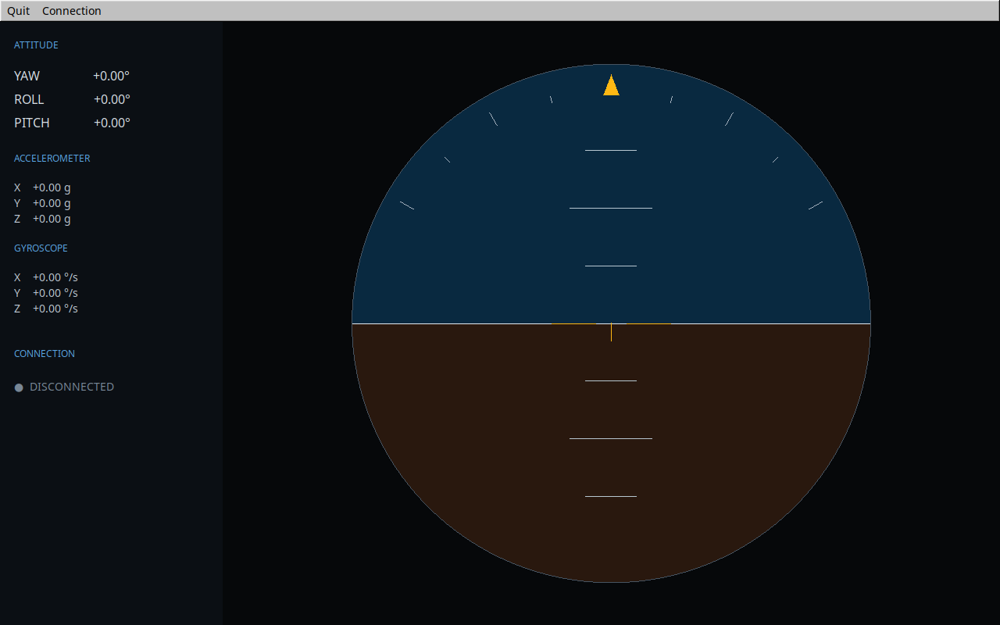
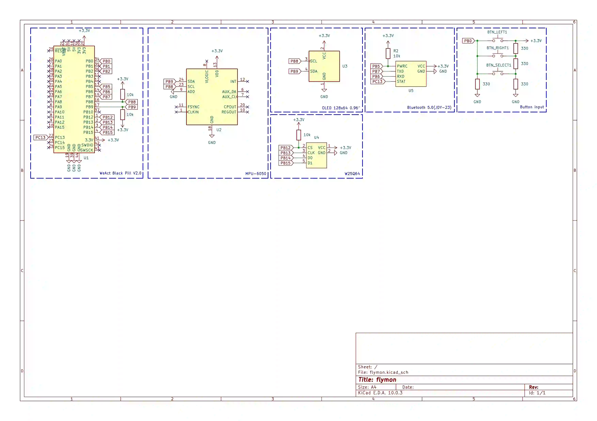

# flymon
Flight monitor with BLE MAVLink telemetry and desktop app for visualization.
Core systems work, but getting the desktop app to connect to jdy-23 is a problem due to poor bluetooth drivers on linux.
This is a toy project so the device is powered through USB/ST-Link.


## Building
Firmware
```
cmake --preset stm32-release
cmake --build --preset stm32-release
```
Desktop application
```
cmake --preset x64
cmake --build --preset x64
```
## Hardware used
| Component | Purpose |
| ----------- | ----------- |
| STM32F411CEU6 | MCU |
| MPU6050 | Accelerometer and gyroscope |
| OLED 0.96" | Displaying firmware information and real time stats from MPU6050 |
| W25Q64 | Storage of calibration data|
| JDY-23 | Sending telemetry to desktop app |
| Buttons | Interacting with user interface |
## Project structure
```
.
├── cmake                   # toolchain configs
├── CMakeLists.txt
├── CMakePresets.json
├── hardware                # schematic and notes to it
├── images                  # project images
├── README.md
└── src
    ├── desktop             # desktop telemetry app
    └── firmware            # stm32 firmware
        ├── bsp             # board-specific stuff
        ├── drivers         # hardware drivers
        │   ├── devices     # external device drivers
        │   ├── peripherals # mcu peripheral drivers
        └── services        # app-level services(ui,scheduler...)
```
